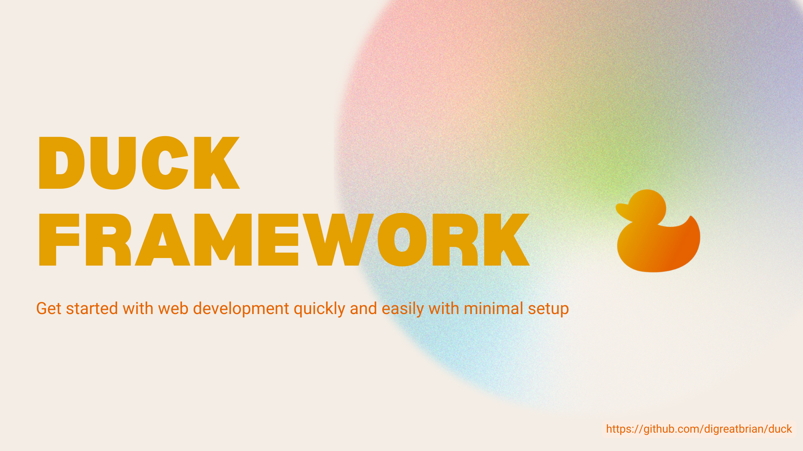
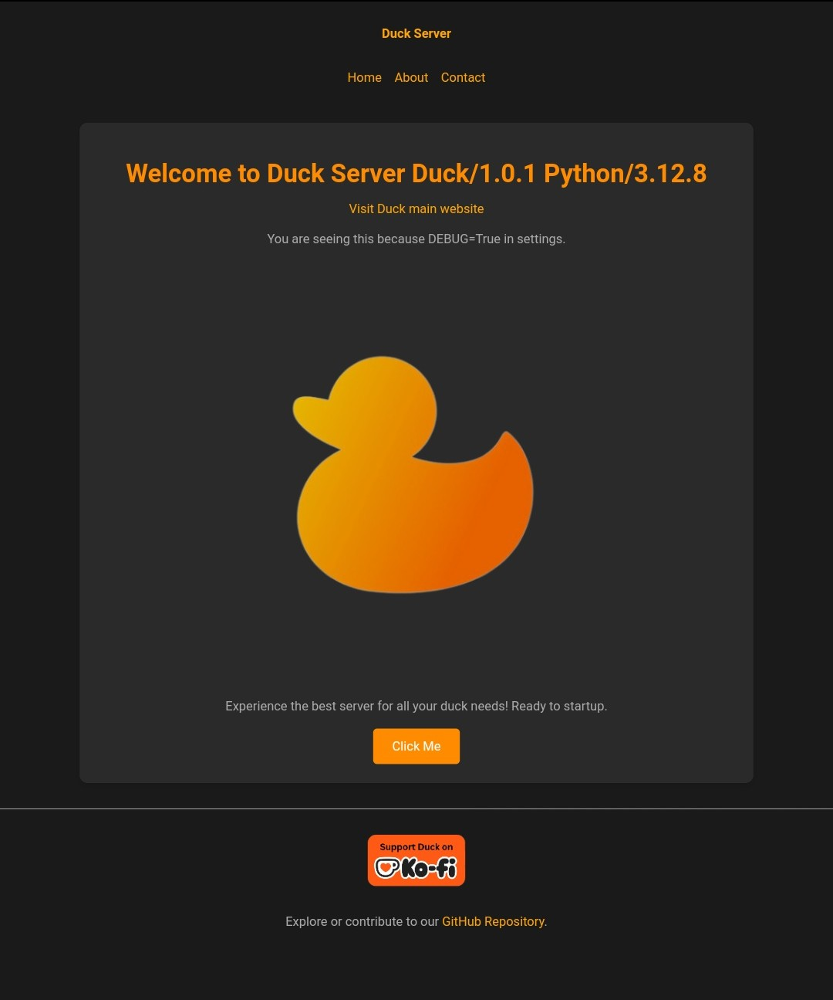
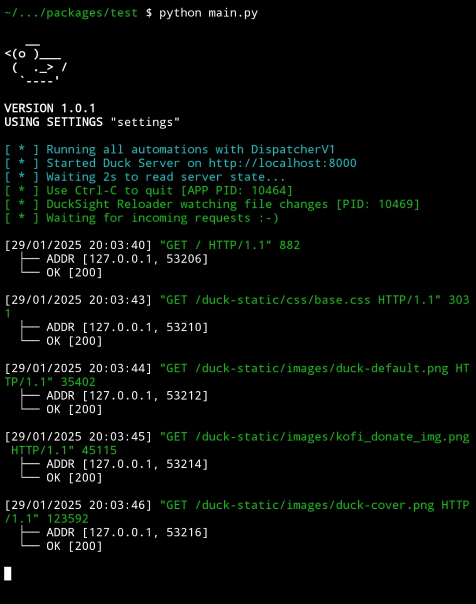
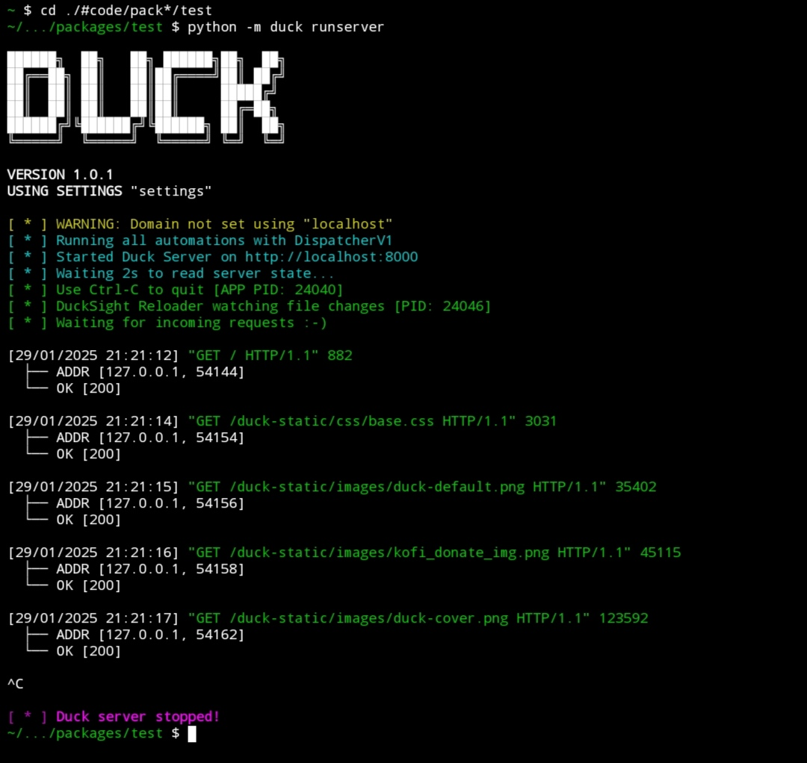

# 🦆 Duck Webserver and Proxy
  

**Duck** is a new advanced, Python-based **web server**, **framework**, and **proxy** designed for seamless integration with **Django**.
It simplifies **web development** by providing built-in **HTTPS support**, simple **SSL certificate generation**, and powerful **customization options**.
With **Duck**, developers can quickly deploy secure, high-performance applications with minimal configuration. Ideal for creating scalable, secure, and customizable **web solutions**, **Duck** streamlines the development process while ensuring top-notch security and performance.


## ✨ Features

- **Django Integration**: Effortlessly connect with Django projects.
- **HTTP/2 Support**: Enables efficient multiplexing, header compression, and improved performance over HTTP/1.1. This feature allows multiple streams to be handled simultaneously over a single connection, reducing latency and improving resource loading. It also includes automatic negotiation for clients that support HTTP/2 while maintaining backward compatibility with HTTP/1.1.
- **HTTPS & SSL**: Easily generate and manage SSL certificates for secure connections.
- **Quick Setup**: Minimal configuration needed to start development.
- **Enhanced Security**: Offers a strong security layer for production servers.
- **Versatile Template Engines**: Supports Jinja2 and Django templates, complete with built-in tags and filters.
- **Logging Options**: Supports file and console-based logging for easier debugging.
- **Reusable HTML Components**: Quickly integrate prebuilt, dynamic, and flexible HTML elements.
- **Extensive Customization**: Easily adjust settings in settings.py for tailored configurations.
- **Task Automation**: Automate repetitive tasks to streamline workflows.
- **Blueprints**: Group and organize routes for better readability and project management.
- **Live Reloading**: Automatically restart the server on file changes with **DuckSight Reloader**.
- **React Template Integration**: Seamlessly integrate **React** code into Django or Jinja2 templates.
- **Dual Connection Mode**: Supports handling requests using both **keep-alive** and **close** connection modes.
- **Threading & Async Support:** Duck supports both threading for CPU-bound tasks and asynchronous handling for I/O-bound tasks, providing flexibility and scalability for various types of applications.Defaults to asynchronous handling.
- **Micro App Support:** Create lightweight, independent sub-applications with their own servers and ports. Each micro app can handle its own requests, providing a flexible architecture for microservices. HttpsRedirectMicroApp included for seamless HTTP to HTTPS redirection.
- **Content Compression**: Support for content compression using **gzip**, **Brotli**, and **deflate** for faster delivery of web assets, improving performance.
- **Streaming Support**: Provides support for **StreamingHttpResponse**, which allows for the efficient delivery of large files or data in chunks. Also supports **StreamingRangeHttpResponse**, which enables the delivery of partial content (ranges) for large files, allowing clients to request specific portions of a file (e.g., video or audio streaming), making it ideal for scenarios like media playback or large data transfers.
- **Built-in Caching Implementations**: Duck includes caching utilities in `duck.utils.caching` to optimize data retrieval and performance. You can use in-memory caching or configure file-based or database-backed caching for better performance, especially for frequently accessed data.
- **Duck Utilities**: The `duck.utils` module includes a wide range of helper functions and utilities, such as those for URL parsing, managing ports, handling request parameters, and more. These utilities simplify common tasks and enhance your development experience when building applications with Duck


## 🔧 Upcoming Features

- **SNI Support**: Host multiple websites on the same IP using Server Name Indication.
- **Load Balancer**: Built-in mechanism for distributing traffic using multiple servers and workers (processes for handling requests).
- **Server Analytics**: Monitor and analyze server traffic and statistics.
- **Credential Manager**: Securely store sensitive data like database credentials.
- **Elevate Duck's Online Presence**: Build a dedicated website to foster a thriving community, share knowledge, and streamline access to resources.
- **Remote Server Backends**: Enable proxy compatibility to seamlessly handle client requests via remote servers (currently supports only Django).
- **Admin Site**: Effortlessy manage Duck using customizable administration site.


## 🚀 Getting Started

### Installation

**Install Duck using pip**:
```sh
git clone https://github.com/digreatbrian/duck.git
python3 install ./duck
```
### Requirements

Before using Duck, ensure the following dependencies are installed:
```sh
Django>=5.1.5
Jinja2>=3.1.5
watchdog>=4.0.1
requests>=2.31.0
h2==4.2.0 # for http/2 support
diskcache
colorama
click
tzdata # for django time conversions
http.client # used by requests library
```
**The above packages will be automatically installed when you do `pip install ./duck`**  

### Create a New Project

*To start a new project, run*:

```sh
duck makeproject myproject
```

### Duck makeproject modes
1. **Normal project**:  
Create a normal average project.
```sh
duck makeproject myproject
```
2. **Mini project**:  
Create a mini version project with lesser files and directories.
```sh
duck makeproject myproject --mini
```
3. **Full project**:  
Create a full complete project with all settings and necessary files and directories. Use this to see all the 
or customize the Duck configuration.
```sh
duck makeproject myproject --full
```

*Project structure:*

```
# Full version
myproject/
├── apps/
│   └── ...
├── backend/  
│   ├── django/  
│   │   └── duckapp/  
│   │       ├── settings.py  
│   │       ├── urls.py  
│   │       ├── views.py  
│   │       └── ...  
│   └── manage.py
├── etc/
│   ├── ssl/
│   │       ├── server.crt
│   │       └── server.key
│   └── README.md
├── .env
├── .gitignore
├── automations.py
├── main.py  
├── settings.py
├── templatetags.py
├── urls.py
├── views.py
├── requirements.txt
├── LICENSE
├── README.md
└── TODO.md

```

```
# Normal version
myproject/  
├── backend/  
│   ├── django/  
│   │   └── duckapp/  
│   │       ├── settings.py  
│   │       ├── urls.py  
│   │       ├── views.py  
│   │       └── ...  
│   └── manage.py
├── main.py  
├── settings.py
├── urls.py
├── LICENSE
├── README.md
├── TODO.md
├── requirements.txt
└── views.py
```

```
# Mini version
myproject/  
├── backend/  
│   ├── django/  
│   │   └── duckapp/  
│   │       ├── settings.py  
│   │       ├── urls.py  
│   │       ├── views.py  
│   │       └── ...  
│   └── manage.py
├── main.py  
├── settings.py
├── urls.py
├── requirements.txt
└── views.py
```

**Note: To collect static files from the root rather than blueprint directories, make sure you create and place the static files in `static` directory**

### Logging
Duck logs everything to both the console and files (in assets/.logs directory). You can customize logging configuration in settings.py.
 

### Running the Server

To start the Duck server, navigate to your project directory and run:
```sh
python main.py # or duck runserver --file main.py
```

*Alternatively, use:*
```sh
cd myproject  
duck runserver -p 8000 -d 'localhost' # The -d flag resolves to the server domain.
```
Then open http://localhost:8000 or https://localhost:8000 if **ENABLE_HTTPS** is enabled in **settings.py**.

**Note**: Running the app from the terminal ignores **main.py** unless explicityly specified using **--file** argument.

You can use **--ipv6** argument to start server on ipv6 address.

*Once you open your browser at the respective url, you should see something like this.*



### What Your Terminal Looks Like After Running `duck runserver`

After running the `duck runserver` command, your terminal should display output similar to the examples below:

**For Smaller Terminals:**


**For Larger Terminals:**


## Don’t just clone or scroll—show your support by leaving a star! ⭐


## Example Application Files

```py
# main.py

from duck.app import App  

app = App(port=8000, addr='127.0.0.1') # App(port=8000, addr='::1', uses_ipv6=True) for ipv6

if __name__ == '__main__':
	app.run()
```

```py
# views.py

def home():  
    return "<h1>Hello world</h1>" # or a duck.http.HttpResponse object.
```

```py
# urls.py

from duck.urls import path, re_path
from . import views  

urlpatterns = [  
    path("/", views.home, "home", methods=["GET"]), # methods is optional
]

```

## 🚀 HTTP/2 Support  

Duck supports **HTTP/2** using the `h2` Python package, enabling faster and more efficient communication compared to HTTP/1.1. With features like multiplexing, header compression, and lower latency, HTTP/2 significantly improves performance. 

⚠️ **Warning:** It is strongly recommended to use HTTP/2 only over a **secure HTTPS** connection. Running HTTP/2 over an unencrypted connection (h2c) in production may expose your data to security risks.

### 🔧 Getting Started  
To enable HTTP/2 in Duck, simply set the following in your configuration:  
```python
HTTP_2_SUPPORT = True
```

### 🔄 Switching to HTTP/2  

There are **two** ways to enable HTTP/2 in your Duck web app:  

1️⃣ **Enable HTTPS** by setting:  
   ```python
   ENABLE_HTTPS = True
   ```
This ensures secure communication and automatically enables HTTP/2 support.

2️⃣ **Send an Upgrade Header to Duck**:

```py
Upgrade: h2c
```

This allows **HTTP/1.1 clients** to request an upgrade to h2c (HTTP/2 over cleartext).

By using either of these methods, **Duck** will seamlessly switch to **HTTP/2**, improving **speed**, **efficiency**, and **overall performance**. 🚀🔥


## Django Integration 🐍  
**Duck** has seamless Django integration which enables more control and customization of the web development process. You can use **Django and Duck** interchangeably within the same project.  

While **Duck** does not currently support database models, which would enable data migration, etc., **Django ORM** is a good option to use. This means you can define `urlpatterns` that rely on databases, which will be handled by the **Django backend**, while lightweight routes can be managed by Duck—more likely used as a CDN.

Alternatively, if you want to access Django ORM without defining separate `urlpatterns` (on both the Duck and Django sides), you can convert a Duck request to a Django request using:  
```py
duck.backend.django.utils.duck_to_django_request  
duck.backend.django.django_to_duck_request  
```
or vice-versa. The `duck.backend.django.utils` module provides more functions that help facilitate the interaction between Duck and Django. Keep in mind that using these tools may ensure only essential fields are transferred, but not all attributes from one request/response object may be preserved.

Feel free to use an alternate ORM, as **Duck** is not limited to Django's ORM.

### Getting Started with Django 🚀  
To enable Django, set `USE_DJANGO = True` in your `settings.py` file. Once this is done, all HTTP traffic will be forwarded to the Django server, even for `urlpatterns` defined in Duck. This behavior can be stopped by setting `DUCK_EXPLICIT_URLS` in `settings.py`.  

`DUCK_EXPLICIT_URLS` is a list of regex URLs that you want Duck to handle directly, instead of passing them to Django (e.g., Django admin site). You can also specify URLs for Django to handle strictly by setting `DJANGO_SIDE_URLS`. These settings are clearly documented in `settings.py`.

You can leverage Duck and Django interchangeably for various use cases, like using Duck as a CDN or for handling APIs.  

---

### Security in Django Integration 🔒  
**Duck** prioritizes security when integrating with **Django**. The Django server is protected by ensuring that only Duck can communicate with it.
If you try to access the **Django** server directly after it has been set up by Duck, the request will be automatically rejected. Duck configures Django to accept requests only from hosts that both Duck and Django know.

By using **Django** as the backend, an additional layer of security is introduced. New requests must pass through both Duck and Django middleware, adding an extra level of protection before reaching the core application.
This layered security approach helps ensure that each request is thoroughly validated, enhancing the overall safety of your application. 🔐

Duck modifies the following headers before sending the request to the Django server:  
```
Host  
Origin (if present)
Referer (if present)
```

### How can I obtain the headers modified by Duck in their original state? 🤔  
Don't worry—Duck provides a solution!  
When these headers are modified, the original headers will be set with a `D-` prefix. You can easily retrieve the real header by doing this:
```py
header = headers.get("D-Some-Header")
```

*You can also use Duck template tags and filters, which might not be built into Django's template engine, by using the following:*
```django

```

**See the Duck full project documentation for more Django customization options.**


## 📘 Blueprints

Organize routes/urlpatterns using blueprints for better management. Blueprints let you group URL patterns under a single namespace.

**Note**: Blueprint names determine the route prefix.
For example, a route `/home` under a blueprint named products becomes `/products/home`. This behavior may be disabled by parsing set argument `prepend_name_to_url` to False.

**You can create multiple blueprints under same blueprint.py file.**

### 🗺️ Blueprint Structure Example

```
myproject/  
├── some_name/  
│   ├── blueprint.py  
│   └── views.py  
├── main.py  
├── settings.py  
├── urls.py  
└── views.py
```

### Example Blueprint

```py
# blueprint.py

from duck.routes import Blueprint
from duck.urls import re_path, path
from . import views  

ProductsBlueprint = Blueprint(
    location=__file__,
    name="products",
    urlpatterns=[
        path(
            f"/list-products",
            views.product_list_view,
            name="list-products",
            methods=["GET"],
        ),
    ],
    prepend_name_to_urls=False,
    is_builtin=False,
    enable_template_dir=True,
    enable_static_dir=True,
)

```

```py
# settings.py

BLUEPRINTS = [  
    "some_name.blueprint.ProductsBlueprint",  
]
```

## Micro Apps in Duck Framework
## What is a Micro App?

A **Micro App** is a small, independent application that runs on its own server (HTTP or HTTPS) and port. It can be part of a larger Duck-powered project but operates separately, handling its own requests and responses.

## Key Features

- **Independent Servers**: Each micro app runs on its own server, meaning it does not affect other parts of the application.
- **Custom Ports**: You can assign a specific port for your micro app, so it won’t interfere with other services.
- **Custom Views**: Micro apps handle their own requests through a `view` method, allowing you to define custom behavior.
- **Redirect HTTP to HTTPS**: Duck includes a built-in **HttpsRedirectMicroApp**, which automatically redirects HTTP traffic to HTTPS for better security.

## How to Use Micro Apps

1. **Creating a Micro App**: To create a micro app, simply instantiate the `MicroApp` class and configure its address and port.

```python
from duck.microapp import MicroApp

# Create a simple micro app running on port 8081
app = MicroApp(port=8081)
app.run()
```
2. **Defining a View:** Define a view method within your micro app to handle incoming requests and generate responses.
```py

class MyMicroApp(MicroApp):
    def view(self, request, processor):
        return HttpResponse("Hello from My Micro App!")
```

3. **Handling HTTP to HTTPS Redirects:** Duck provides a built-in HttpsRedirectMicroApp, which automatically redirects HTTP traffic to HTTPS. This can be controlled via the configuration in Duck's settings, so you don't need to manually implement it.  

To enable **HTTPS redirection**, simply configure Duck to use the HttpsRedirectMicroApp in your settings:

```py
DUCK_SETTINGS = {
    "FORCE_HTTPS": True,
    "ENABLE_HTTPS": True,
}
```

4. **Running the Micro App:** Once your micro app is configured, you can run it independently, and it will handle requests on its own port.


## Duck CLI

The **Duck CLI** provides a powerful command-line interface for managing and interacting with your **Duck** web server and framework. It is designed for ease of use, allowing you to perform various tasks with simple commands.

To get started, just type `duck` in your terminal to view available commands and their usage. The **Duck CLI** is powered by **Click**, ensuring an intuitive and user-friendly experience for developers of all levels.

With **Duck CLI**, you can streamline your workflow, automate tasks, and quickly manage configurations, making your development process more efficient and effective.


## 🔒 HTTPS and SSL Guide
Duck provides **built-in SSL configuration** with default server certificates and private keys for **development and testing** purposes.

⚠️ **Notice:** If you're using **Duck's default SSL configuration**, your browser may display a warning about an "attacker" or an untrusted certificate. This happens because the default SSL setup is meant for **development purposes only** and uses a self-signed certificate. You can safely ignore this warning during development, but for production, it's recommended to use a valid **SSL certificate** from a trusted **Certificate Authority** (CA).


### ✅ Enabling HTTPS  
To activate HTTPS, set the following in your `settings.py`:  
```python
ENABLE_HTTPS = True
```

### 🔄 Force HTTPS Redirection  
To automatically redirect **all HTTP traffic to HTTPS**, enable the redirect feature:  
```python
FORCE_HTTPS = True
```

⚠️ **Note:** FORCE_HTTPS requires ENABLE_HTTPS to be set to True.

---

## 🚀 SSL Certificate Generation  
Duck includes an **`ssl-gen`** command to generate SSL certificates.

### 📌 Requirements  
Ensure you have **OpenSSL** installed before running the command.


## 🛠️ Production Recommendations

Use port 80 for HTTP and port 443 for HTTPS in production.

**Secure your SSL configuration for enhanced security.**


## Duck Automations ⚙️

Duck offers powerful automation capabilities that can run tasks throughout your application's lifecycle. With Duck automations, you can schedule tasks to run when specific triggers occur, or you can set them up to run automatically at specified times. 

These automations are incredibly useful for a variety of purposes, such as:

- Automatically generating SSL certificates 🔒
- Handling routine maintenance tasks 🛠️
- Managing scheduled backups ⏳
- Triggering notifications or other actions based on specific events 📲

By leveraging Duck's automation framework, you can save time, reduce manual intervention, and ensure critical tasks are handled efficiently and reliably.


## Templates

Duck uses **Django** as the default templating engine, but you can also use **Jinja2 templates** if preferred. Duck uses Django template engine by default because there is a wide variety of templatetags and filters. Additionally, you can create custom template tags and filters within Duck, which will be available for use in both Jinja2 and Django templates.

**Note**:
- To use Duck’s custom tags or filters in a Django-rendered template, include the following at the top of the template:
  ```django
  
  ```


## HTML Components to Use in Templates

Duck provides several HTML components that can be dynamically created and rendered in your templates. These components can be used in both **Jinja2** and **Django** templates.

## Usage Examples

### Jinja2 Template

You can use the HTML components like so in a Jinja2 template:

```jinja2
{{ Button(
    style={
        "background-color": "red",
        "color": "white",
    },
    properties={
        "value": "Hello world",
        "id": "btn"
    },
) }}
```

### Django Template

In Django templates, the usage is slightly different, and you need to ensure that the tag is on one line and keyword arguments are quoted as strings:
	
```django

     properties={
         "id": "btn",
         "value": "Hello world"
      },
      style={
           "background-color": "blue",
            "color": "white"
       },
       optional_argument="Some value"

```

## HTML Components Configuration

### Enable HTML Components

By default, HTML components are enabled. You can configure whether to enable or disable the HTML components by setting the ENABLE_HTML_COMPONENTS variable in your settings:
```py
# settings.py

ENABLE_HTML_COMPONENTS: bool = True
```


### Available HTML Components

Duck comes with several pre-defined HTML components that you can use in your templates. These components are mapped to their corresponding classes.

```py
# settings.py

HTML_COMPONENTS: dict[str, str] = {
    "Button": "duck.html.components.button.Button",
    "FlatButton": "duck.html.components.button.FlatButton",
    "RaisedButton": "duck.html.components.button.RaisedButton",
    "Input": "duck.html.components.input.Input",
    "CSRFInput": "duck.html.components.input.CSRFInput",
    "Checkbox": "duck.html.components.checkbox.Checkbox",
    "Select": "duck.html.components.select.Select",
    "TextArea": "duck.html.components.textarea.TextArea",
}
```


## Creating Custom HTML Components

If you want to create your own HTML components, you can subclass one of Duck's base component classes: InnerHtmlComponent or NoInnerHtmlComponent.

### Example: Creating a Custom Button Component
```py
from duck.html.components import InnerHtmlComponent


class CustomButton(InnerHtmlComponent):
    """
    CustomHTML Button component.
    """
    def get_element(self):
        return "button"
    
    def on_create(self):
         # Modify or update style and properties
         
         # update style here using setdefaults
         # Note: there is an "s" for setdefaults for dictionary instead of key and value
         self.style.setdefaults({
             "color": "white",
             "background-color": "red",
         })
         
         if "onclick" self.kwargs:
             self.properties.setdefault("onclick", self.kwargs.get("onclick")) # you can optionally modify props and style absolutely by using update or indexing

```

**InnerHtmlComponent:** This is used when your HTML component has inner content, like a button or a div. You can define the content and the styles inside this component.

**NoInnerHtmlComponent:** This is used for self-closing tags, like inputs or checkboxes, where there’s no inner HTML content.


### How the Classes Work

**InnerHtmlComponent:** This is used for components that contain inner HTML (e.g., buttons, divs).  

**NoInnerHtmlComponent:** This is used for components that do not contain inner HTML (e.g., input fields, checkboxes).

---

This setup makes it easy to add reusable HTML components to your templates and customize their appearance and behavior by simply passing `properties`, `inner_body` and `styles`. You can also extend this by creating custom components to suit your needs.


## React Integration

Duck provides built-in **React integration**, allowing you to easily render React components and JSX code within your templates.
The default React configuration is pre-enabled, so you can get started quickly without any extra setup.


### Default Configuration
The default React configuration in Duck is as follows:

```py
FRONTEND: dict[str, dict] = {
    "REACT": {
        # URLs or file paths for loading React, ReactDOM, and Babel scripts (JavaScript only).
        # **Note**: The Babel script is required for JSX to JavaScript compilation.
        "scripts": [
            # React development script from UNPKG CDN
            "https://unpkg.com/react@17/umd/react.development.js",
            
            # ReactDOM development script from UNPKG CDN
            "https://unpkg.com/react-dom@17/umd/react-dom.development.js",
            
            # Babel standalone script for JSX transformation in the browser
            "https://unpkg.com/@babel/standalone/babel.min.js"
        ],

        # The root URL for serving the React application.
        # This URL will serve the JSX code inside the "react_frontend" template tag.
        "root_url": "/react/serve",

        # URL for serving the React-related scripts.
        # The final route for the scripts will be a combination of root_url and scripts_url.
        "scripts_url": "/scripts",
    }
}
```

### Example Use Case
```html
<body id="root">


// React code goes here
const App = () => {
    return (
      <div>
       <h1>Hello, React!</h1>
       <p>Welcome to your first React app!</p>
     </div>
   );
};

// Rendering the React app into the #root element
ReactDOM.render(<App />, document.getElementById('root'));


</body>
```

### Customization
The default React configuration can be customized based on your project's needs.
You are free to modify the settings (e.g., changing script URLs, adjusting the root URL) to suit your preferences.


### Setting Up React
To ensure smooth integration of React with Duck, run the following command in your terminal:

```bash
cd yourproject
python3 -m duck collectscripts
```

### Security
Duck ensures the security of your React files and code when serving them, safeguarding your app while providing seamless React integration.


## Use React within your template using the following template tag:

```django

    Your JSX Code here

```

## Troubleshooting Tips:

### SSL Certificate Issues:
If SSL certificates are not being generated, ensure that OpenSSL is installed correctly on your machine. You can verify OpenSSL with:

```sh
openssl version
```

Also, check the permissions of the etc/ssl directory to ensure the webserver can write the certificates.

### Port Conflicts:
If the server fails to start due to a port conflict, check if the port is already in use by another service. You can specify an alternative port by passing the -p <port> argument:

```sh
python3 -m duck runserver -p 8080
```

### Django Disallowed Host Error

If you encounter the following error when running the Duck application:
```py
Invalid HTTP_HOST header: 'sq7441iv4yyg1iczep3meyga1lbhpu.gkr.pxyecarnhz.com'. You may need to add 'sq7441iv4yyg1iczep3meyga1lbhpu.gkr.pxyecarnhz.com' to ALLOWED_HOSTS.
```

This typically indicates that another instance of Django launched by Duck is already running. This instance may be configured to allow only specific hosts. To resolve the issue, you need to stop the old Django process before starting the new instance.

### Example:

To stop the old Django process, you can use the following steps:

1. List the running processes:

    ```
    $ ps
      PID TTY          TIME CMD
    4491 pts/0    00:00:00 /data/data/com.termux/files/usr/bin/bash
    21276 pts/0    00:00:02 python
    21285 pts/0    00:00:00 ps
    ```

2. Kill the old Django process (assuming the PID is 21276):

    ```
    kill 21276
    ```

Once the old process is stopped, you can continue with your new Django instance.


## Is it Worth Moving from Django Only to Duck? 🤔

The short answer is **Yes**! If you already have a Django application running, making the transition to Duck is straightforward. You don’t need to completely migrate your Django project—just configure a few settings, and you’ll be able to seamlessly integrate Duck into your existing setup.

You can continue using your existing Django project without starting from scratch. Duck enhances your current infrastructure, giving you more flexibility and control over certain processes while maintaining the stability of your Django application.

So, it’s not about migrating from Django; rather, it’s about extending and improving what you already have with the power of Duck! 🚀


## 📜 License
**Duck** is licensed under the BSD License. See the [LICENSE](./LICENSE) file for details.


## 💬 Support
For questions or issues, please open an issue on the **Duck GitHub repository**.


## Documentation

The documentation may appear unclear or incomplete.
We welcome contributions to improve it and make it more accessible for everyone.

## Support This Project

[](https://ko-fi.com/digreatbrian)
**Your feedback is valuable! Share your ideas for new features or improvements you'd like to see in this amazing project.**

---
**Start building secure, scalable, and customizable web applications with Duck today!**
